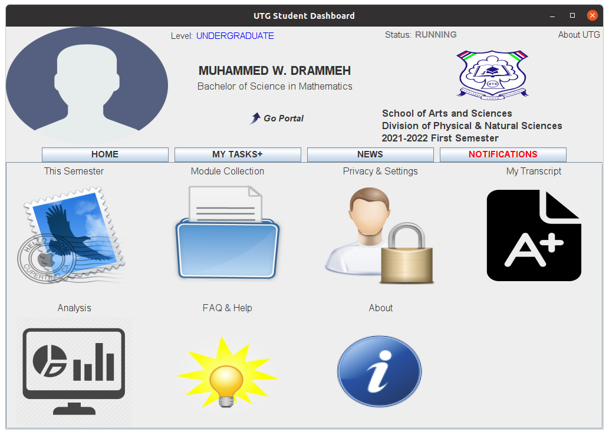
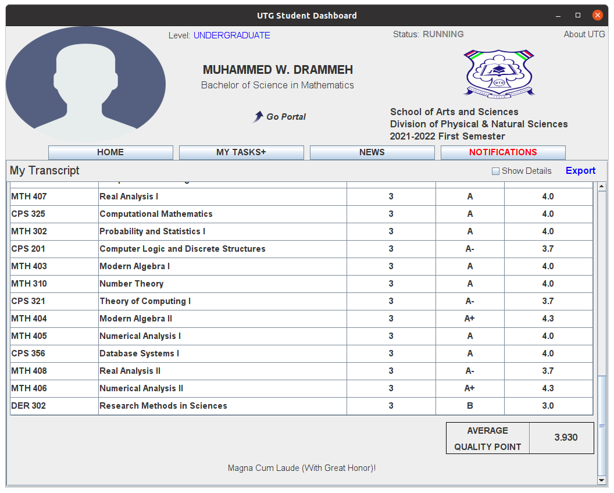
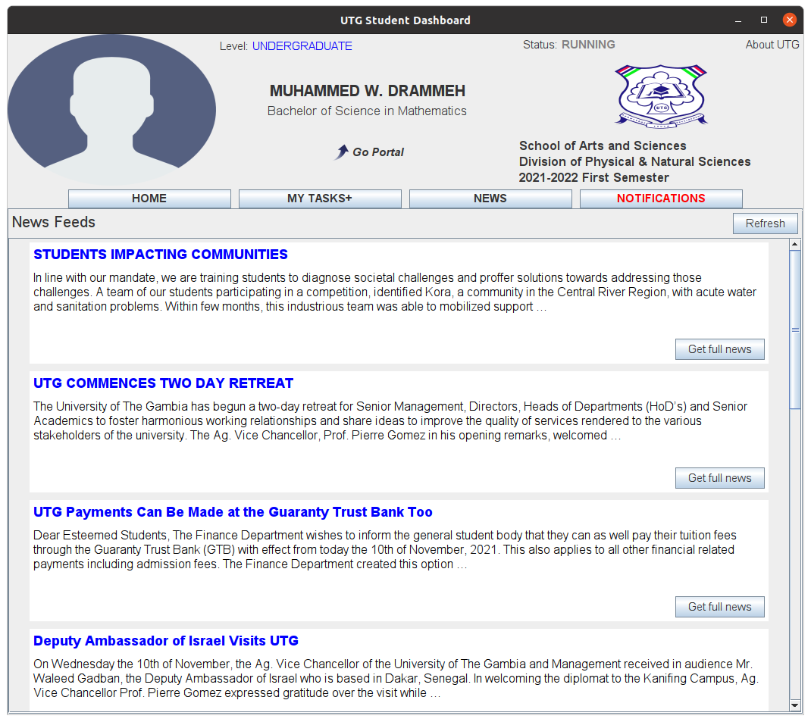
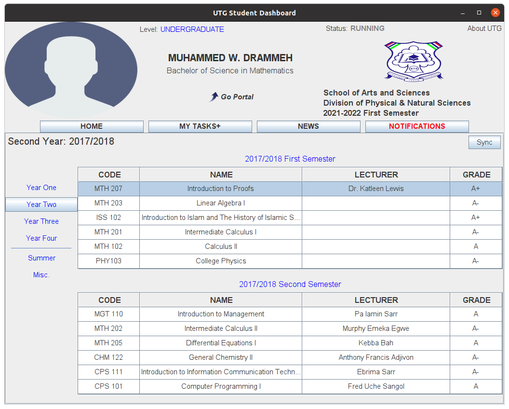
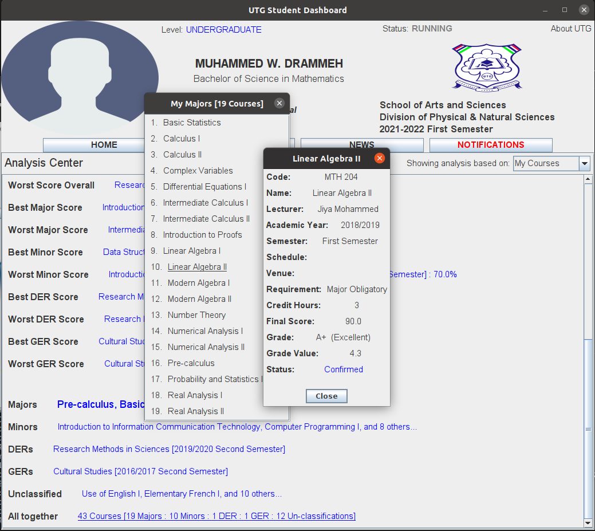
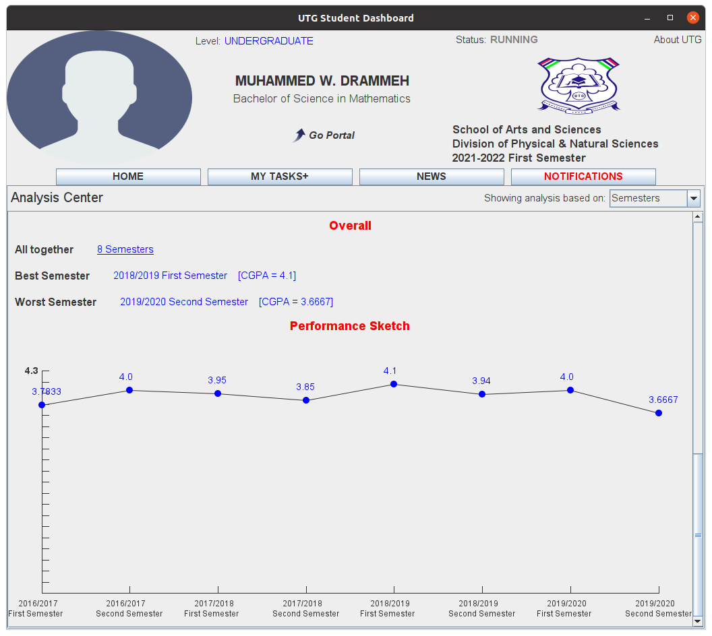
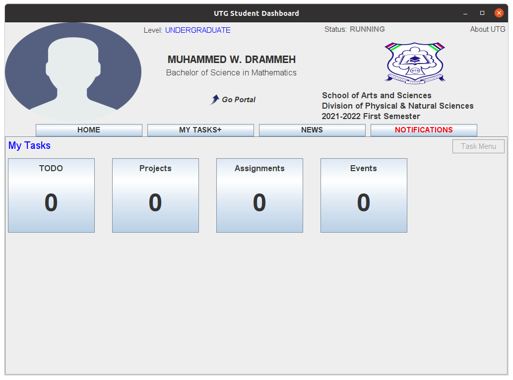

# UTG Student Dashboard

`v1.1.1`

A **Flexible** and **Elegant** student management system for the University of The Gambia ("UTG").

Dashboard is a **student management tool** (built by the students for the students).
This project brings to the palms of the students (of UTG) solutions to problems they’ve long anticipated. So, use it to organize your course-work!

## Install

Get the standalone installation file for your operating system from the table below:

| Platform (OS) | Get Dashboard | Type | Requirement |
| ----- | ----- | ----- | ----- |
| Microsoft Windows | [utg-student-dashboard-1.1.1.exe](https://github.com/wdrammeh/utg-student-dashboard/releases/download/v1.1.1/utg-student-dashboard-1.1.1.exe) | exe |  |
| Linux | [utg-student-dashboard_1.1.1-1_amd64.deb](https://github.com/wdrammeh/utg-student-dashboard/releases/download/v1.1.1/utg-student-dashboard_1.1.1-1_amd64.deb) | deb |  |
| All / Any | [utg-student-dashboard-1.1.1-standalone.jar](https://github.com/wdrammeh/utg-student-dashboard/releases/download/v1.1.1/utg-student-dashboard-1.1.1-standalone.jar) | jar | [Java 11+](https://www.oracle.com/java/technologies/downloads/) |

More download options (including jar builds) are available on the [release page](https://github.com/wdrammeh/utg-student-dashboard/releases).

If you wish, you may check out [what's new](ChangeLog.md) about this release.

## Functionality

Once Dashboard is installed correctly, expect to enjoy the following cool features:

### 1. **Offline** content management capability

Once you go through the setup (login) process, a window similar to the one below will be at your disposal - the home page, from where you could access all your academic related stuff. And you need no internet connection!

### 2. **Unlimited** Transcript Exportation

Your transcript is always ready for printing! Save it to your file system, share it with the world!

### 3. **News** updates from UTG official site

Dashboard keeps you updated with the institutions latest news.

### 4. Course Collection

All your courses at one place, organized and classified.

### 5. Course Analysis & Presentation

A sample analysis on your major courses. Dashboard auto-detects your major courses using your _major code_. Analysis on your minor program is also provided; as well as on your GERs, DERs.

### 6. Realtime performance analysis

See how you're doing.

### 7. TODO

Do more with Dashboard using its Tasks+ extension. You can keep track of your projects, assignments, upcoming events with timely reminders. Additional support is provided for the assignment type. Check it out!

### And much more...

## System Requirements

- [Firefox Web Browser](https://www.mozilla.org/en-US/firefox/new/)

## Contribution

If you are interested in making this project better, firstly, read our [Developers Guide](Contributing.md).

## ERP Notice

Dashboard uses the **UTG ERP System** ("Portal") as the center of verification for users. By using Dashboard, the student (user) is agreeing that Dashboard collects any Portal-related data and use it for, but not limited to, **verification**, **analysis**, and **presentation**.

> This project is not endorsed by the University of The Gambia. Under no condition shall the UTG be held responsible for the content (including the source code, logos, ideas, and not even the End User License Agreement) presented herein. This project is a sole work of independent developers.

It is however important to note that inconsistent data from the Portal can induce misbehavior of your Dashboard. Thus, it is strongly advisable for students victim of wrong, or incomplete details on their Portals to refer to their respective departments for help before, or anytime soon after, launching Dashboard.

We however handle, gracefully, the common issue of missing-grades, but cannot afford to miss core details like student's name, or matriculation number. Dashboard may halt build, if such details are missing, or not readable somehow.
